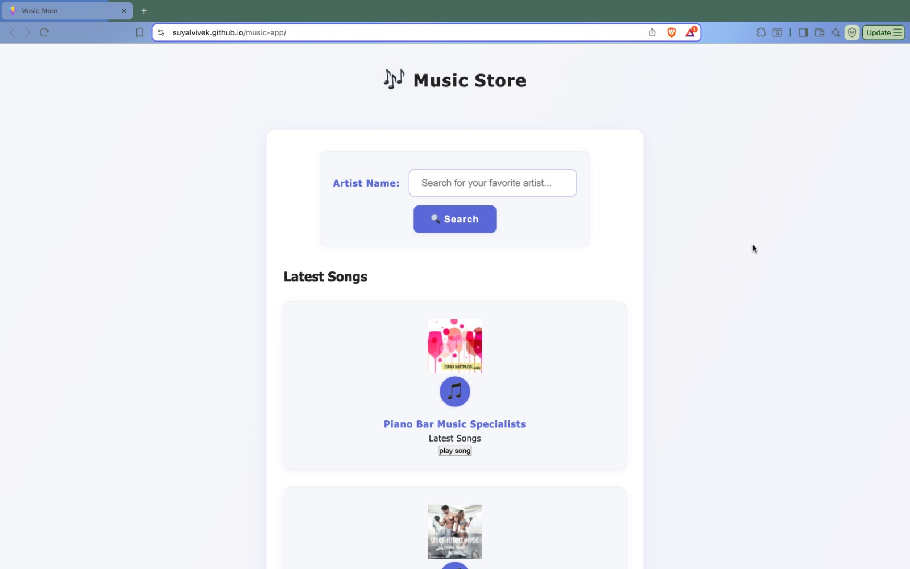
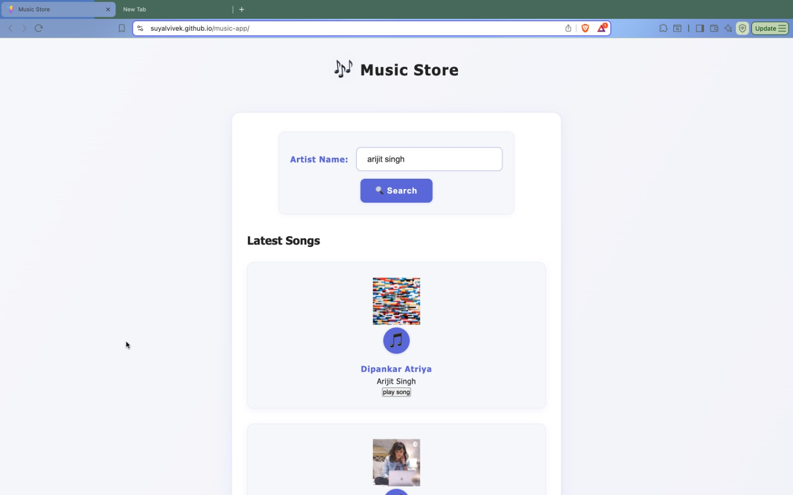

# 🎵 Music Store

<div align="center">
  
  
  
  
</div>

<p align="center">
  A modern, responsive music streaming application built with React and powered by the iTunes Search API. 
  <br>
  Stream, search, and discover your favorite tracks with a sleek user interface.
</p>

<div align="center">
  <a href="#features">Features</a> •
  <a href="#demo">Demo</a> •
  <a href="#installation">Installation</a> •
  <a href="#usage">Usage</a> •
  <a href="#api">API</a> •
  <a href="#contributing">Contributing</a>
</div>

---

## 🚀 Features

### 🎶 Core Functionality
- **Smart Search**: Real-time song search using iTunes Search API
- **Audio Player**: Full-featured player with play/pause, seek, and volume controls
- **Track Information**: Display album art, artist, track name, and duration
- **Responsive Design**: Optimized for desktop, tablet, and mobile devices

### 🎨 User Experience
- **Modern UI**: Clean, intuitive interface built with Tailwind CSS
- **Fast Loading**: Optimized with Vite for lightning-fast development and builds
- **Smooth Animations**: Seamless transitions and hover effects
- **Accessibility**: Keyboard navigation and screen reader support

## 📱 Demo

> **Live Demo**: [View Application](https://suyalvivek.github.io/music-app)

### Screenshots

  <p align="center">
  
    
</p>

## 🛠️ Installation

### Prerequisites
- Node.js (v16 or higher)
- npm or yarn package manager

### Quick Start

```bash
# Clone the repository
git clone https://github.com/Suyalvivek/music-app.git

# Navigate to project directory
cd music-app

# Install dependencies
npm install

# Start development server
npm run dev

# Build for production
npm run build

# Deploy to GitHub Pages
npm run deploy
```

### Environment Setup

Create a `.env` file in the root directory:

```env
VITE_APP_NAME=Music Store
VITE_ITUNES_API_BASE_URL=https://itunes.apple.com/search
```

## 📖 Usage

### Basic Usage

1. **Search**: Enter an artist name or song title in the search bar
2. **Browse**: View search results with album artwork and track details
3. **Play**: Click on any track to start playing
4. **Control**: Use the player controls to pause, seek, or adjust volume

### Advanced Features

- **Keyboard Shortcuts**: 
  - `Space` - Play/Pause
  - `←/→` - Seek backward/forward
  - `↑/↓` - Volume up/down

## 🏗️ Project Structure

```
music-app/
├── public/
│   ├── favicon.ico
│   └── index.html
├── src/
│   ├── components/           # Reusable UI components
│   │   ├── common/          # Generic components
│   │   │   ├── Button.jsx
│   │   │   ├── Input.jsx
│   │   │   └── Loading.jsx
│   │   ├── layout/          # Layout components
│   │   │   ├── Header.jsx
│   │   │   ├── Footer.jsx
│   │   │   └── Navigation.jsx
│   │   ├── player/          # Player-specific components
│   │   │   ├── Player.jsx
│   │   │   ├── PlayerControls.jsx
│   │   │   └── TrackInfo.jsx
│   │   └── search/          # Search-related components
│   │       ├── SearchBar.jsx
│   │       ├── SearchResults.jsx
│   │       └── SongCard.jsx
│   ├── hooks/               # Custom React hooks
│   │   ├── usePlayer.js
│   │   ├── useSearch.js
│   │   └── useLocalStorage.js
│   ├── services/            # API and external services
│   │   ├── api.js
│   │   ├── itunes.js
│   │   └── storage.js
│   ├── utils/               # Utility functions
│   │   ├── formatTime.js
│   │   ├── constants.js
│   │   └── helpers.js
│   ├── styles/              # Global styles
│   │   ├── index.css
│   │   └── components.css
│   ├── pages/               # Page components
│   │   ├── HomePage.jsx
│   │   ├── SearchPage.jsx
│   │   └── PlayerPage.jsx
│   ├── App.jsx              # Main application component
│   └── main.jsx             # Application entry point
├── screenshots/             # Application screenshots
├── .env.example            # Environment variables template
├── .gitignore
├── package.json
├── README.md
├── tailwind.config.js
└── vite.config.js
```

## 🔧 API Reference

### iTunes Search API

The application uses the iTunes Search API to fetch music data:

```javascript
// Example API call
const searchTracks = async (term, limit = 50) => {
  const response = await fetch(
    `https://itunes.apple.com/search?term=${encodeURIComponent(term)}&media=music&limit=${limit}`
  );
  return response.json();
};
```

### Response Format

```json
{
  "resultCount": 50,
  "results": [
    {
      "trackId": 1234567890,
      "trackName": "Song Title",
      "artistName": "Artist Name",
      "albumName": "Album Name",
      "artworkUrl100": "https://...",
      "previewUrl": "https://...",
      "trackTimeMillis": 180000
    }
  ]
}
```

## 🧪 Testing

```bash
# Run tests
npm test

# Run tests with coverage
npm run test:coverage

# Run tests in watch mode
npm run test:watch
```
## 🤝 Contributing

Contributions are welcome! Please feel free to submit a Pull Request.

### Development Setup

1. Fork the repository
2. Create your feature branch (`git checkout -b feature/AmazingFeature`)
3. Commit your changes (`git commit -m 'Add some AmazingFeature'`)
4. Push to the branch (`git push origin feature/AmazingFeature`)
5. Open a Pull Request

### Code Style

- Use ESLint and Prettier for code formatting
- Follow React best practices
- Write meaningful commit messages
- Add tests for new features

## 📝 License

This project is licensed under the MIT License - see the [LICENSE](LICENSE) file for details.

## 🙏 Acknowledgments

- [iTunes Search API](https://affiliate.itunes.apple.com/resources/documentation/itunes-store-web-service-search-api/) for providing music data
- [React](https://reactjs.org/) for the amazing framework
- [Tailwind CSS](https://tailwindcss.com/) for beautiful styling
- [Vite](https://vitejs.dev/) for fast development experience

## 📧 Contact

**Vivek Suyal** - [@Suyalvivek](https://github.com/Suyalvivek)

Project Link: [https://github.com/Suyalvivek/music-app](https://github.com/Suyalvivek/music-app)

---

<div align="center">
  <p>Made with ❤️ by Vivek Suyal</p>
</div>
